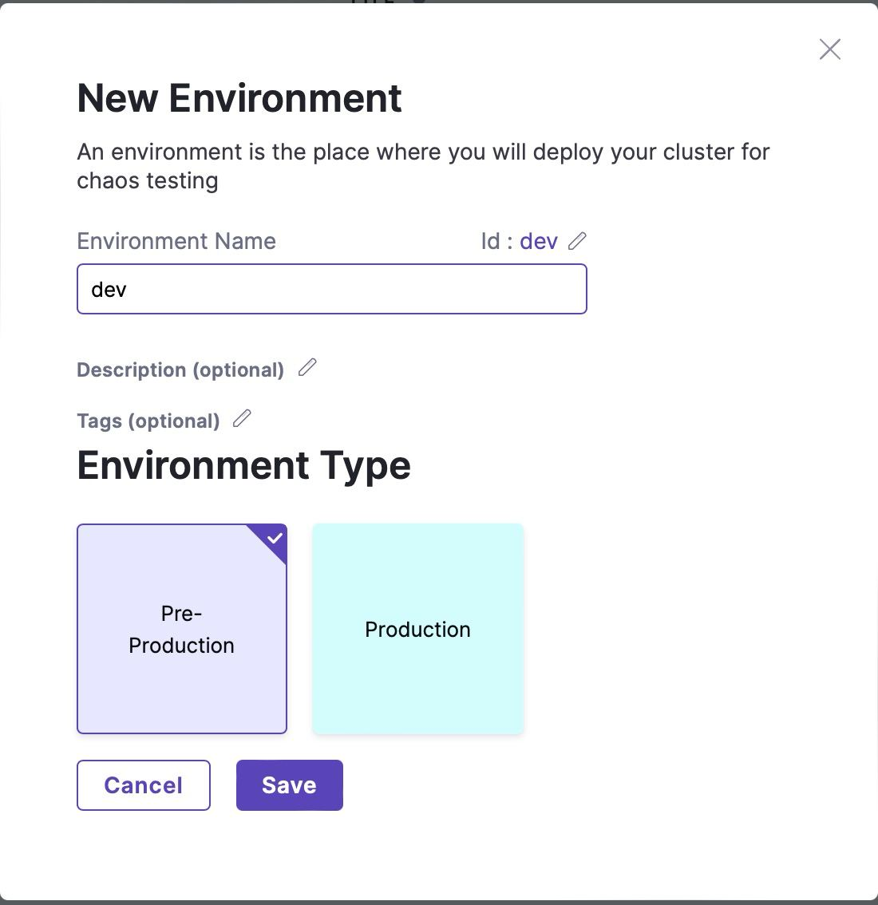
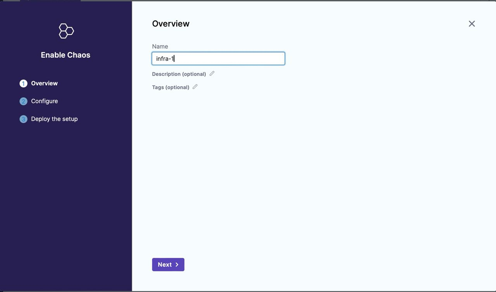
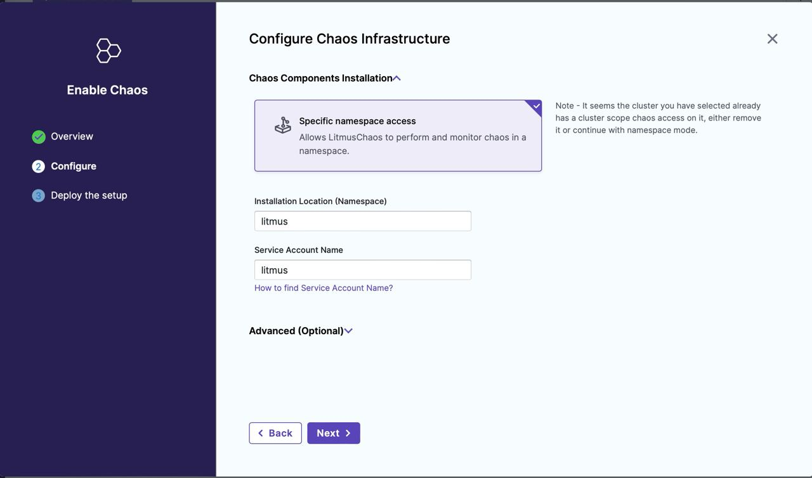
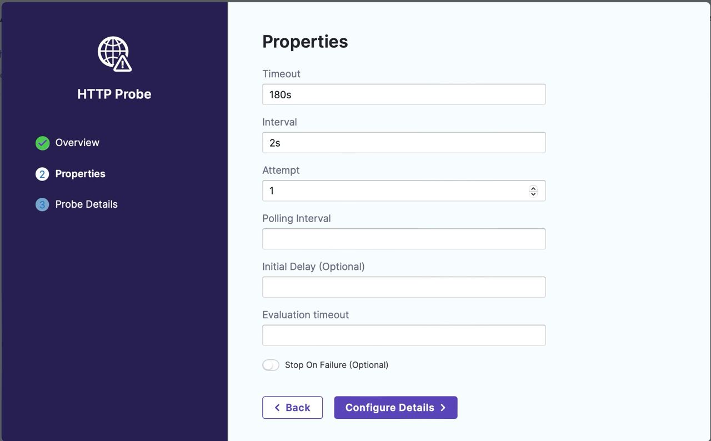
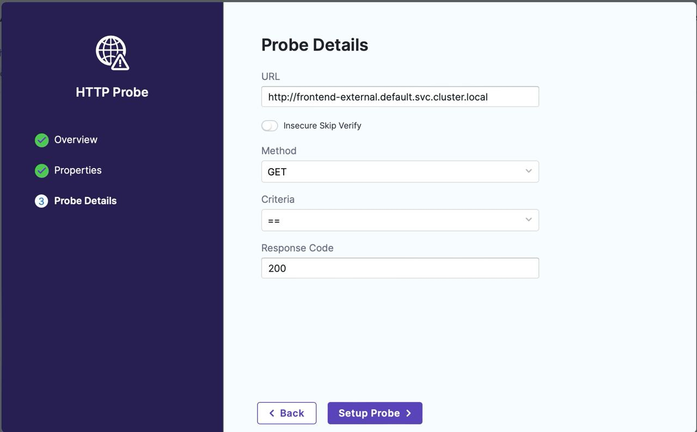
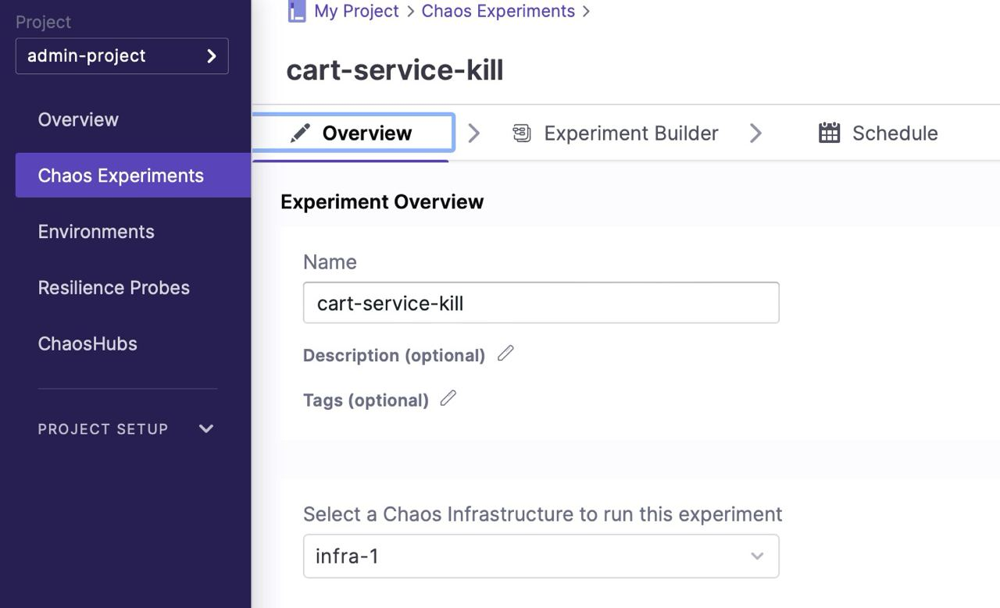
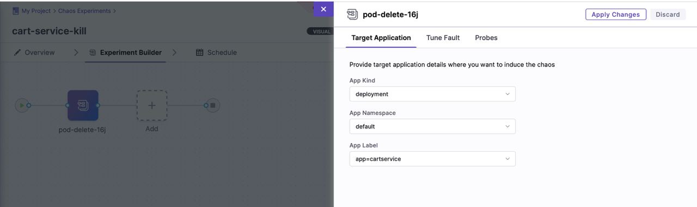
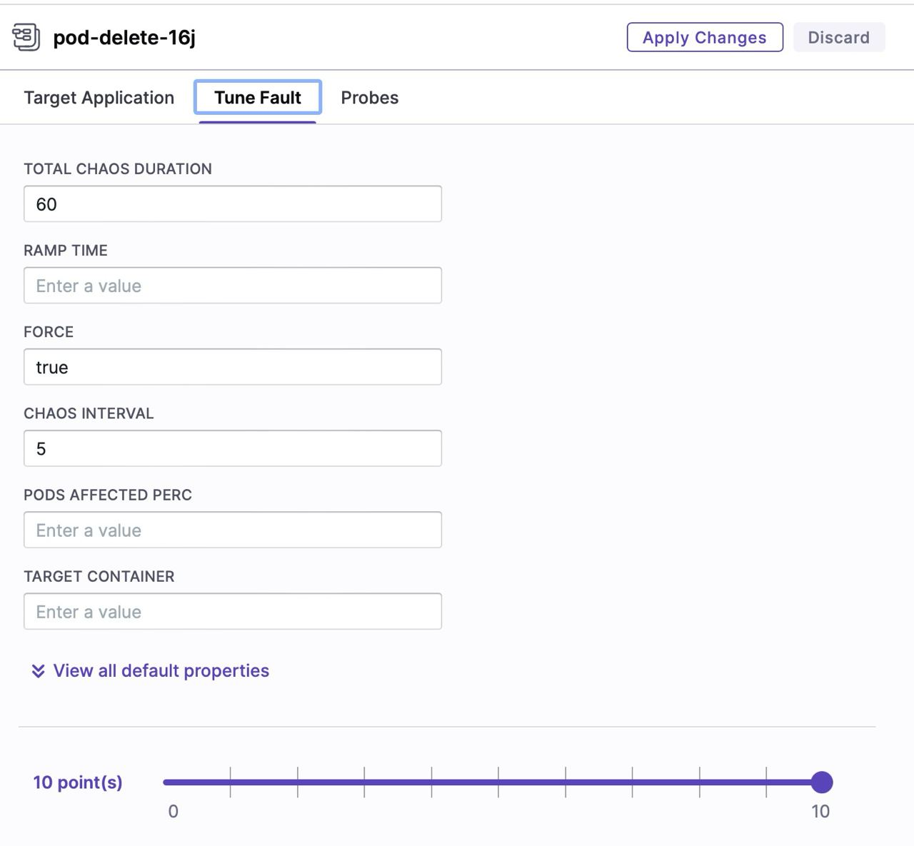
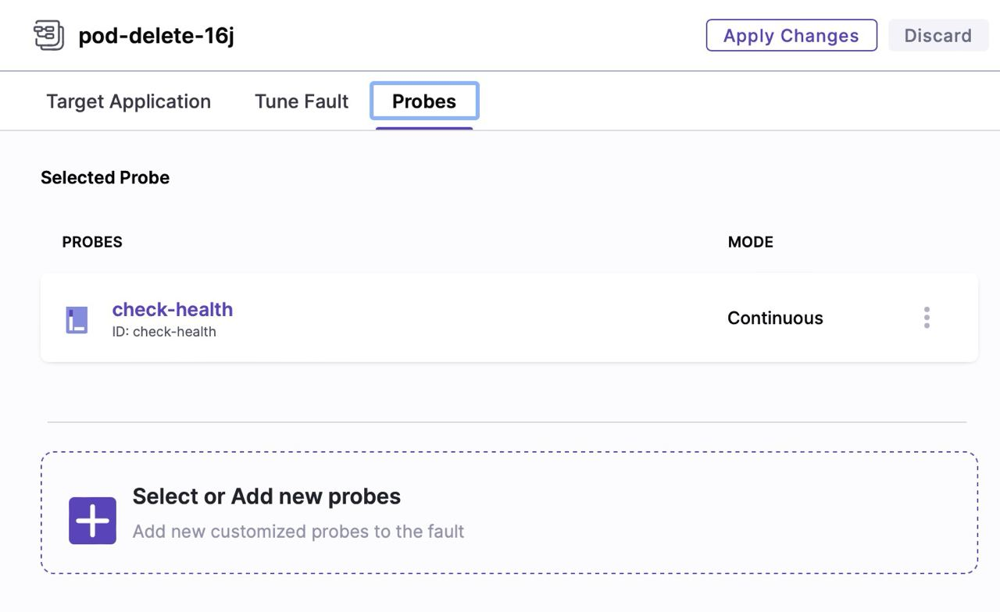

# Litmus Chaos Installation and Reproduction Guide

## Introduction

Litmus Chaos is a toolset to orchestrate chaos engineering in cloud-native environments. It helps in identifying weaknesses and potential outages in infrastructures by injecting controlled failures into the system.

This guide provides detailed steps to install and use Litmus Chaos on x64 and arm64 systems. Additionally, it demonstrates how to run a sample chaos experiment.

## Installation Steps

### 1. Add the Litmus Chaos Helm Repository

First, add the Litmus Chaos Helm repository:

```sh
helm repo add litmuschaos https://litmuschaos.github.io/litmus-helm/
helm repo list
```

### 2. Create a Namespace for Litmus

Create a dedicated namespace for Litmus:

```sh
kubectl create ns litmus
```

### 3. Install Litmus Chaos

#### Install Litmus Chaos (for x64 systems)

```sh
helm install chaos litmuschaos/litmus --namespace=litmus --set portal.frontend.service.type=NodePort
```

#### Install Litmus Chaos (for arm64 systems)

```sh
helm install chaos litmuschaos/litmus --namespace=litmus \
--set portal.frontend.service.type=NodePort \
--set mongodb.image.registry=docker.io \
--set mongodb.image.repository=zcube/bitnami-compat-mongodb \
--set mongodb.image.tag=latest
```

### 4. Access the Litmus Dashboard

To access the Litmus dashboard, expand the available services and copy the `PORT` of the `litmusportal-frontend-service` service:

```sh
kubectl get svc -n litmus
```

Navigate to `http://<NODE_IP>:<PORT>` in your web browser to access the Litmus ChaosCenter.

## Example Usage: Cart Pod Delete

### 1. Create a New Environment

- Log in to the Litmus ChaosCenter.
- Create a new environment.



### 2. Enable Chaos in the Environment

- Click on the newly created environment and select "Enable Chaos."

- Select the installation location and provide the service account name.

- Download the generated YAML file.
- Create the namespace on your Kubernetes cluster:

    ```sh
    kubectl create namespace litmus
    ```

- Apply the Chaos Custom Resource Definitions (CRDs):

    ```sh
    kubectl apply -f https://raw.githubusercontent.com/litmuschaos/litmus/master/mkdocs/docs/3.6.1/litmus-portal-crds-3.6.1.yml
    ```

- Apply the Chaos Infrastructure:

    ```sh
    kubectl apply -f <your-infra-name>-litmus-chaos-enable.yml
    ```

### 3. Create a Health Probe

Create a new health probe to check if the frontend service returns HTTP OK.

- Select probe type (HTTP):


- Configure probe properties:


- Add frontend URL and desired response condition:


### 4. Create a New Experiment

In the Litmus Dashboard, navigate to the "Experiments" section and create a new experiment.



### 5. Configure the Experiment

- **Target Application:** Specify the details of the application you want to target for the chaos experiment (e.g., deployment name):

- **Fault Properties:** Define the chaos scenario you want to simulate (e.g., pod delete). Configure specific properties related to the chosen fault:

- **Health Probe:** Select the previously created health probe to monitor the application's health during the experiment.


### 6. Run the Experiment

Once configured, initiate the chaos experiment within the Litmus Dashboard. The experiment will simulate the chosen fault and monitor the application's behavior using the defined health probe.

## Preconfigured Chaos Experiments

Preconfigured YAML chaos experiment manifests can be found [here](experiment-manifests).

## Experiments Results

JSON with the chaos experiments execution results can be found [here](chaos-results.json).
